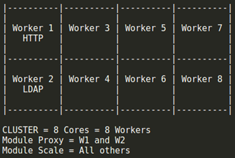
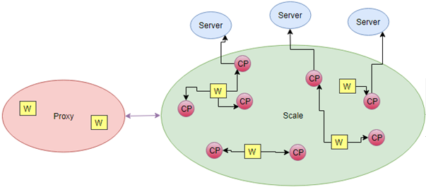
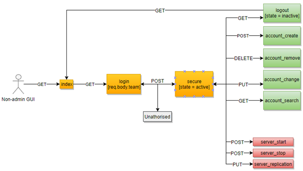

# Project: nodejs_code

Multi-access and multi-competition application

## RESTful API Implemented

Example: http://localhost:3000

### Module master
* /login
* /account_create
* /account_change
* /account_remove
* /admin_remove_team
* /admin_remove_username
* /logout

### Module scale
* /server_start
* /server_stop
* /server_recovery

## Requirements

Linux system (implemented on Ubuntu)

## Installation

* Download repository
* Install node.js
* Install npm
* Install npm install -g nodemon
* Inside the directory do npm install
* Then always nodemon app.js

## Authors

fmpss1@iscte-iul.pt
