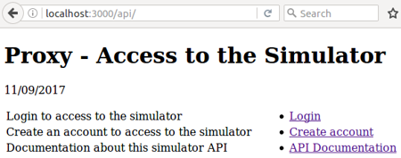
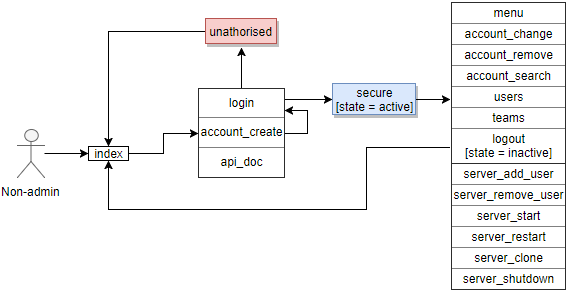
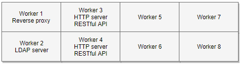
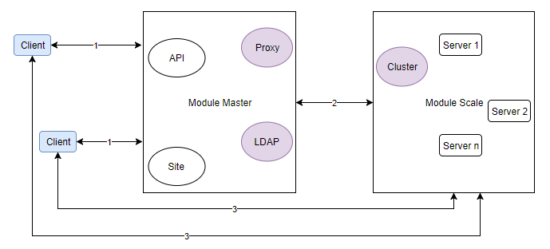
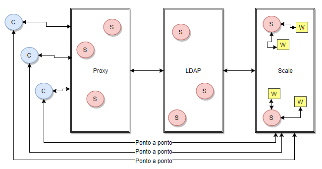
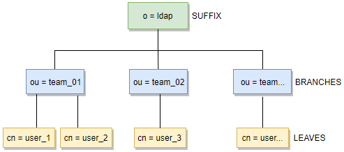

# Project: Multi-access and multi-competition


## Arquitecture and Design

#### Main access by GUI

#### Global API Non-admin

#### Global API Admin

#### Global struture

#### Global design 1

#### Global design 2

#### Global design 3

#### LDAP hierarchy


## RESTful API Implemented
```
Example: http://localhost:3000/api
```

### Module master
* /login
* /account_create
* /api/doc
* /menu
* /account_change
* /account_remove
* /account_search
* /users
* /teams
* /admin_remove_team
* /admin_remove_username
* /logout

### Module scale
* /server_start
* /server_restart
* /server_clone
* /server_shutdown


## Requirements
Linux system (implemented on Ubuntu and Mint)


## Installation
* Download repository
* Install node.js
* Install npm
* Install npm install -g nodemon
* Inside the directory do npm install
* Then always nodemon app.js


## Documentation
JSDoc 3 - Automatic generator for HTML documentation of Javascript sources
```
sudo apt install jsdoc-toolkit
```


## Others
* Sublime Text 3
* Cloud9
* GitHub
* draw.io


## Authors
fmpss1@iscte-iul.pt
