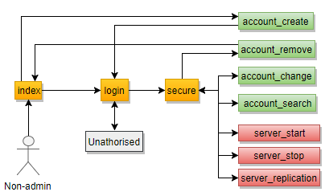
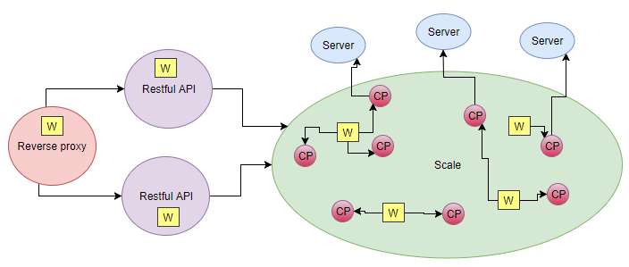

# Project: nodejs_code


Multi-access and multi-competition application








## RESTful API Implemented

```
Example: http://localhost:3000
```


### Module master
* /login
* /account_create
* /account_change_pw
* /account_remove
* /admin_remove_team
* /admin_remove_username
* /logout


### Module scale
* /server_start
* /server_stop
* /server_recovery


## Requirements

Linux system (implemented on Ubuntu)


## Installation

* Download repository
* Install node.js
* Install npm
* Install npm install -g nodemon
* Inside the directory do npm install
* Then always nodemon app.js


## Documentation

JSDoc 3 - Automatic generator for HTML documentation of Javascript sources

```
sudo apt install jsdoc-toolkit
```


## Others

* Sublime Text 3
* draw.io


## Authors

fmpss1@iscte-iul.pt
