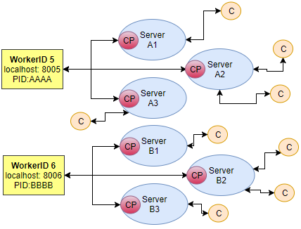

# Project: Scalable Clustering with Node.js

Special attention on multi-access and multi-competition


## Arquitecture and Design

#### Main access by CLI

#### Main access by GUI

#### Global API Non-admin

#### Global API Non-admin GUI


#### Global API Admin GUI

#### LDAP hierarchy

#### Global struture

#### Locally cluster architecture

#### Cloud cluster architecture

#### Global design

#### Global design scale module



## RESTful API Implemented (Two ways to access: CLI and GUI)
```
Example: http://localhost:3000/api
```

### Module master
* /login
* /menu
* /api_doc
* /account_create
* /account_change_pw
* /account_remove
* /account_search_user
* /account_search_users
* /account_search_team
* /account_search_teams
* /admin_remove_team**
* /admin_remove_user**
* /logout

### Module scale
* /server_add_user
* /server_remove_user
* /server_start**
* /server_restart**
* /server_clone**
* /server_shutdown**

** Use only by Administrator


## Requirements
* Linux system (implemented and tested on Ubuntu 16.04.3 LTS)
* Minimum 5 core processor machine


## Installation
*	Download or clone the repositoy (https://github.com/fmpss1/nodejs_code.git)
*	Install node.js e npm (sudo apt-get install nodejs-legacy npm)
*	Install npm install -g nodemon loadtest (optional)
*	Inside the directory do npm install
*	To run the application do node app.js or nodemon app.js
*	Example to add the new middleware to the package.json file: npm install pug -save (optional)


## Documentation
JSDoc 3 - Automatic generator for HTML documentation of Javascript sources

```
Installation: sudo apt install jsdoc-toolkit
```

## Command-line JSON processor
* Request example:
```
curl http://localhost:3000/api | jq
```
* Response example:
```
{
  "Access to the Simulator: http://localhost:3000/api/": {
    "Login to access to the simulator": 
    	"http://localhost:3000/api/login",
    "Create an account to access to the simulator":
    	"http://localhost:3000/api/account_create",
    "Documentation about this simulator API":
    	"http://localhost:3000/api/api_doc",
    "Remember" : "This is case sensitive!"
 }}
```

```
Installation: sudo apt-get install jq
```

## Others
* Sublime Text 3
* Cloud9
* GitHub
* draw.io
* html2pug


## Authors
fmpss1@iscte-iul.pt
